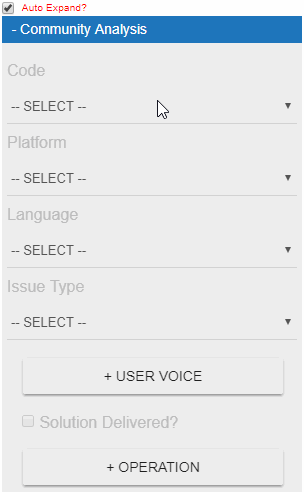
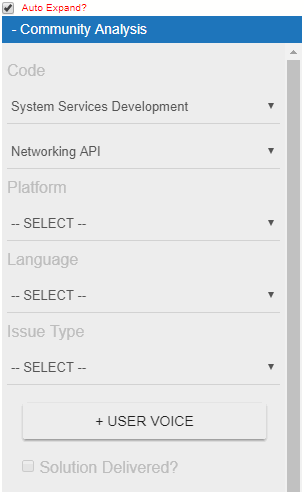
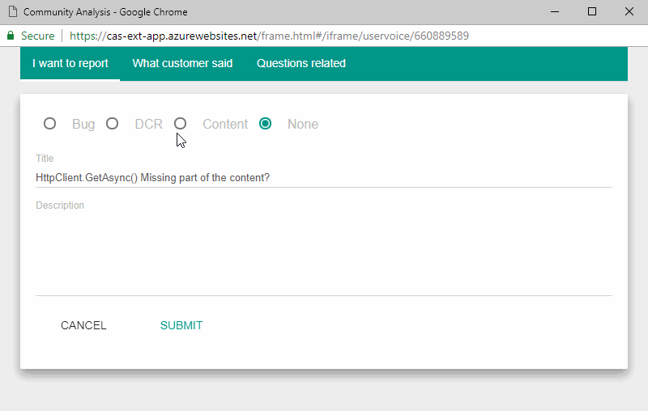
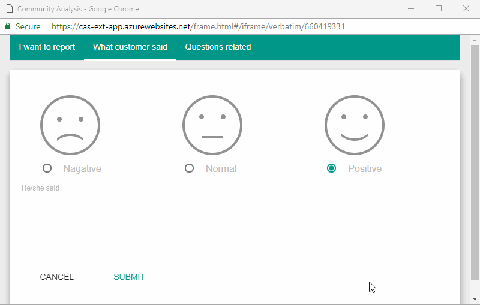

# CA Extension Iframe Introduction

## Auto Expand Option

Check the "Auto Expand" option to expand CA iframe automatically:

## Authentication

Please using **Microsoft work account** to sign in, the token expiry time is one day.

If you encountered weird issue, please check this document: [Troubleshooting CA extension](doc/troubleshooting-easy-analysis-extension.md)

## Limited scenario

The CA system needs to consume external API/engine to import cases and recreate internal instances based on backend scenario dispatch logic.

So if a new case has not been imported to CA, most of the calssification and user voice functionalities won't work. We will see the folowing page:

## Support Topic Tree Classification

## Custom Fields Classification

## User Voice - VoC

*Including Bug/DCR/Content issue*

Click the "**+User Voice**" button to open the child window

## User Voice - Customer Verbatim

*Verbatim feedback is the real-life spoken or written responses from customers about their service experience.*

Click the "**+User Voice**" button to open the child window, click the "What customer said" to log verbatim

## Operation

- Problem Resolution - For **vendor** team solution delivered(SD) identification
- Escalation - For **vendor** team escalation
- Consultation - For **vendor** team consultation